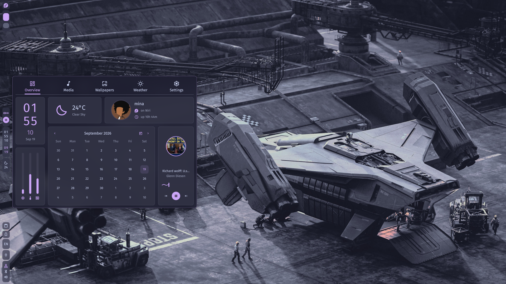
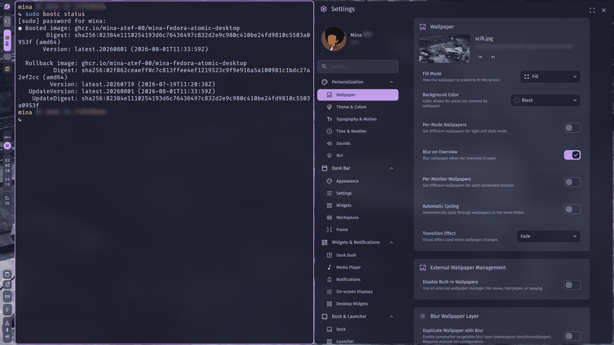

# mina-fedora-atomic





A personal Fedora Atomic image I build for my own machines. The point is
reproducibility: the OS, the drivers, the desktop and the hardware quirks all live in
this repository, and nothing is configured by hand on a running system. Two hardware
profiles come out of the same source:

| Profile | Image name | Target |
|---|---|---|
| `asus` | `mina-fedora-atomic-desktop` | Desktop, NVIDIA (`akmods-nvidia-open`), X11 and `modprobe` overrides |
| `lnvo` | `mina-fedora-atomic-laptop` | Laptop, Intel (`i915`), `tlp` power management |

I use it on my own machines. This is not a
general-purpose distribution: the README documents how I build it.

## What is mine and what is inherited

The build starts from Universal Blue's public `ghcr.io/ublue-os/base-main:44` image,
a Fedora 44 base for bootc systems. That base OS, its kernel and its package set are
inherited. Everything this repository adds is custom: the Containerfile, the eight
build scripts under `files/scripts/`, and the system and per-profile config files
under `files/system/` and `files/profiles/`.

The Containerfile has twelve `FROM` stages. Three of them pull upstream images
(`base-main:44` and the two `akmods` images). The other nine are the build chain: one
copies `files/` into the build context, and eight each run one script from
`files/scripts/`:

| Stage | Script | What it does |
|---|---|---|
| `ctx` | (build context) | Copies `files/` into the build context |
| `setup` | `base.sh` | Pre-cleanup, environment prep, makes `/opt` immutable |
| `akmods` | `akmods.sh` | Enables RPM Fusion, installs common akmods (`v4l2loopback`, `ublue-os-addons`) and, for the `asus` profile, the NVIDIA open kernel modules and userspace drivers |
| `core` | `core.sh` | Core desktop, filesystems and networking; enables the COPR repos used later |
| `media` | `media.sh` | Multimedia, codecs, editors, Git |
| `apps` | `apps.sh` | CLI and GUI tools, remaining COPRs, sets Fish as the default shell, records the COPR list so `final.sh` can disable it |
| `profile` | `profile.sh` | Profile-specific drivers, systemd units and configs; copies `files/profiles/<profile>/` and the shared `files/system/` tree into the image |
| `theme` | `theme.sh` | Fonts (RPM, Nerd Fonts, Microsoft), Papirus icon theme, GTK defaults, icon and font caches |
| `final` | `final.sh` | Removes unwanted packages, disables COPRs, sets up Flathub, cleans the package manager and menu, minimizes `/var` and boot, then runs `bootc container lint` |

Baked-in system config lives in `files/system/` (dnf config, `environment.d`, greetd,
`sshd` on port 2200, sysusers, polkit rules, udev rules for controllers and bootc
kernel args) and per-profile hardware files in `files/profiles/{asus,lnvo}/`. The
desktop is niri with Dank Material Shell, shipped as skel configs.

## Requirements

- `podman` (tested on 5.8.4, rootless works)
- `just`
- at least 20 GB of free disk (the base image is 6.2 GB and the result is 13 GB)
- network access to `ghcr.io` and the Fedora and RPM Fusion mirrors
- optional: `shellcheck` and `shfmt` for `just lint` and `just format`

## Build it

```bash
git clone https://github.com/mina-atef-00/mina-fedora-atomic.git
cd mina-fedora-atomic

# desktop (asus, NVIDIA)
just build mina-fedora-atomic-desktop asus

# laptop (lnvo, Intel)
just build mina-fedora-atomic-laptop lnvo
```

`just build` runs `podman build` with `--build-arg HOST_PROFILE=<profile>` and
`--build-arg IMAGE_NAME=<image name>`, tags the result `localhost/<image name>:latest`,
and pulls the base and akmods images with `--pull=newer`.

Two checks that need no build:

```bash
just --list      # list every recipe
just check       # validate Justfile syntax
just lint        # shellcheck every *.sh
```

### Verified build

Run 2026-09-17 from a fresh `--depth 1` clone on a Fedora Atomic 44 host (kernel
`7.1.5-201.fc44.x86_64`, rootless podman 5.8.4). Wall time about 40 minutes, almost
all of it pulling the 6.2 GB `base-main:44` image and the two akmods images. The tail
of the log:

```console
[12/12] STEP 8/8: RUN bootc container lint
Lint warning: nonempty-boot: Found non-empty /boot:
  initramfs-7.2.5-200.fc44.x86_64.img

Lint warning: nonempty-run-tmp: Found content in runtime-only directories (/run, /tmp):
  /run/akmods
  /run/akmods/akmods.lock
  /run/dnf
  /run/gluster
  /run/selinux-policy
  ...and 51 more

Lint warning: var-tmpfiles: Found content in /var missing systemd tmpfiles.d entries:
  d /var/lib/build-state 0755 root root - -
  d /var/lib/iscsi 0755 root root - -
  ...and 25 more

Checks passed: 10
Checks skipped: 1
Warnings: 3
[12/12] COMMIT localhost/mina-fedora-atomic-desktop:latest
--> 10aad3a62e94
Successfully tagged localhost/mina-fedora-atomic-desktop:latest
EXIT=0
```

## Bootable images (optional)

The `Justfile` also drives bootc-image-builder to turn the container image into a disk
image:

```bash
just build-qcow2 localhost/mina-fedora-atomic-desktop latest   # disk_config/disk.toml
just run-vm-qcow2 localhost/mina-fedora-atomic-desktop latest  # boots it in QEMU
just iso asus ghcr                                             # installer ISO, desktop
just iso lnvo ghcr                                             # installer ISO, laptop
```

The disk-image recipes take the image name as a required argument.

## Switch a running system to it

From a machine already running a bootc image:

```bash
sudo bootc switch ghcr.io/mina-atef-00/mina-fedora-atomic-desktop:latest   # asus
sudo bootc switch ghcr.io/mina-atef-00/mina-fedora-atomic-laptop:latest    # lnvo
sudo reboot
```

## Continuous integration

`.github/workflows/build.yml` builds both profiles on push to `main` and on pull
requests, then publishes to
`ghcr.io/mina-atef-00/<image name>` and signs with cosign in key mode (`cosign.pub` is
the public half). Both images are public on GHCR. `build-disk.yml` builds disk images
on manual dispatch; `build-iso.yml` builds installer ISOs on manual dispatch and
after each container build completes. `dependabot.yml` and `renovate.json5` are
configured to propose action and base-image updates. The public key for verification
is [`cosign.pub`](./cosign.pub).

## License

Apache-2.0. See [LICENSE](./LICENSE).
